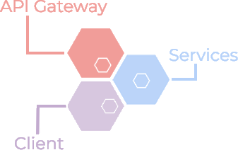

# Microservice Application-Lab
Während der Projektwochen 10 - 12 (23.11.2018 bis 21.12.2018) wurde fortgehend am Microservice Application-Lab gearbeitet.

## Verwendete Technologien
- docker
- docker-compose
- Go
- Java 8
- Python 3.6

## Anleitungen
Die ausführliche Variante ist unter [Anleitung PDF](./Benutzeranleitung_Application_Lab.pdf) zu finden. Die wichtigsten Punkte sind in diesem README.md zu finden.

### In die VM einloggen
Verbinde dich über *SSH* mit der VM.
```
> ssh labuser@wiproh18-tbjauner.el.eee.intern
> password: labuser
```

### Microservice Application-Lab starten
Navigiere auf der VM in den Ordner *wipro18-microservice-application-lab*. Das starten des Application-Lab ist dank *docker-compose* sehr leicht.
```
> cd ~/wipro18-microservice-application-lab
~/wipro18-microservice-application-lab> sudo docker-compose up -d
```
#### Resultat
Folgender Output sollte erscheinen.
```
Starting application_lab_rabbitmq       ... done
Starting application_lab_notification   ... done
Starting application_lab_sales          ... done
Starting application_lab_reminder       ... done
Starting application_lab_client         ... done
Starting application_lab_gateway        ... done
Starting application_lab_warehouse      ... done
Starting application_lab_customer       ... done
```

### RabbitMq Manager öffnen
Wenn das Lab gestartet wurde kannst du in deinem Browser über die Url: http://wiproh18-tbjauner.el.eee.intern:7000 den RabbitMq Manager aufrufen. Logge dich mit folgenden Credentials ein.
```
Username: guest
Passwort: guest
```

#### Resultat
Unter dem Menüpunkt *Exchanges* sollten folgende Exchanges aufgelistet sein.

| Name                            | Typ    |
|---------------------------------|--------|
| ch.hslu.wipro.micros.Article    | Topic  |
| ch.hslu.wipro.micros.Customer   | Topic  |
| ch.hslu.wipro.micros.DeadLetter | Fanout |
| ch.hslu.wipro.micros.Order      | Topic  |
| ch.hslu.wipro.micros.Reminder   | Topic  |

### Client öffnen
Wenn das Lab gestartet wurde kannst du in deinem Browser über die Url: http://wiproh18-tbjauner.el.eee.intern:7002 den Client aufrufen. Logge dich mit folgenden Credentials ein.

#### Resultat
Folgender Output sollte erscheinen.

| Service                                                              | Status  |
|----------------------------------------------------------------------|---------|
| http://wiproh18-tbjauner.el.eee.intern:7001/gateway/reminders/health | running |
| http://wiproh18-tbjauner.el.eee.intern:7001/gateway/customers/health | running |
| http://wiproh18-tbjauner.el.eee.intern:7001/gateway/warehouse/health | running |
| http://wiproh18-tbjauner.el.eee.intern:7001/gateway/sales/health     | running |