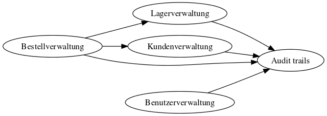
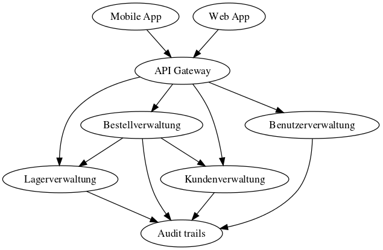

# System Architecture
The following graph shows the dependencies between the microservices.

The following graph shows the dependencies between the microservices and the api gateway.

The following graph shows the dependencies between the microservices and backends as frontends.

### Software
I used the following webpage to create the graphs:
- http://www.webgraphviz.com/